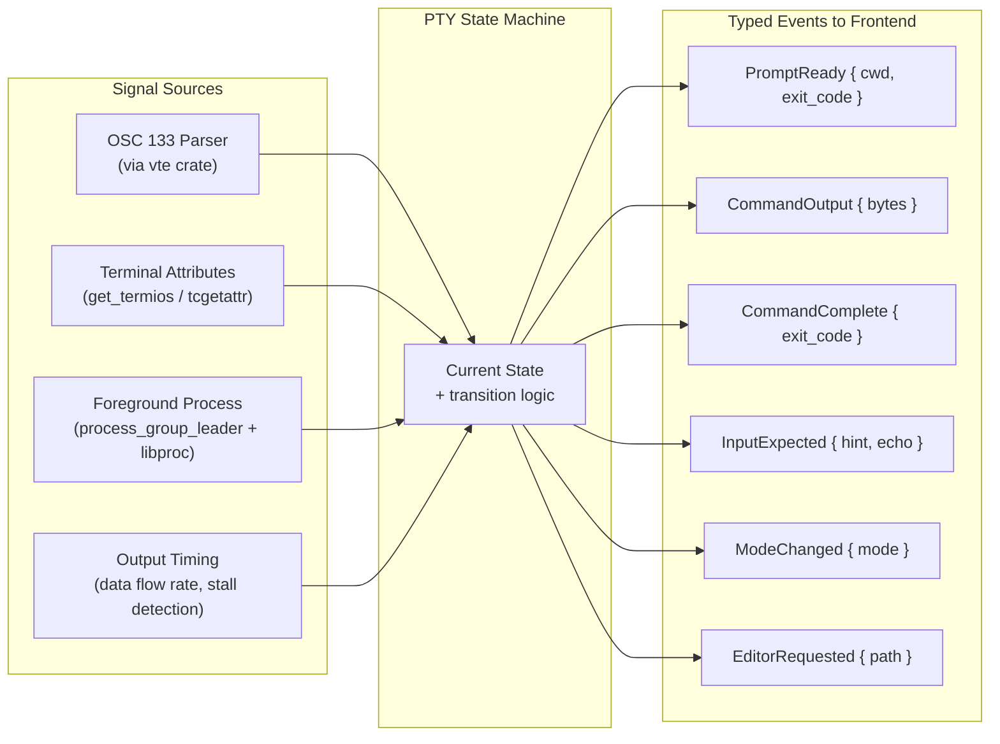
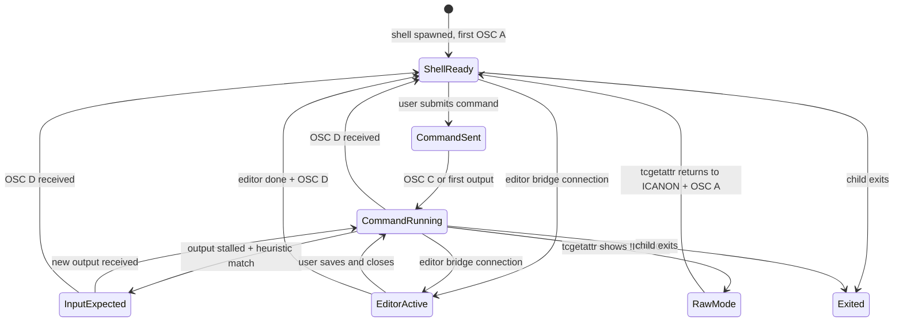
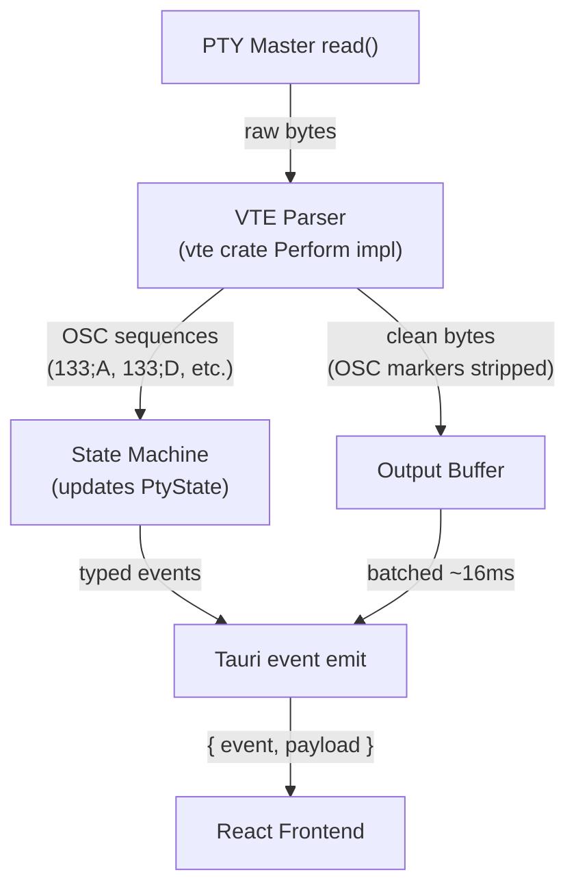
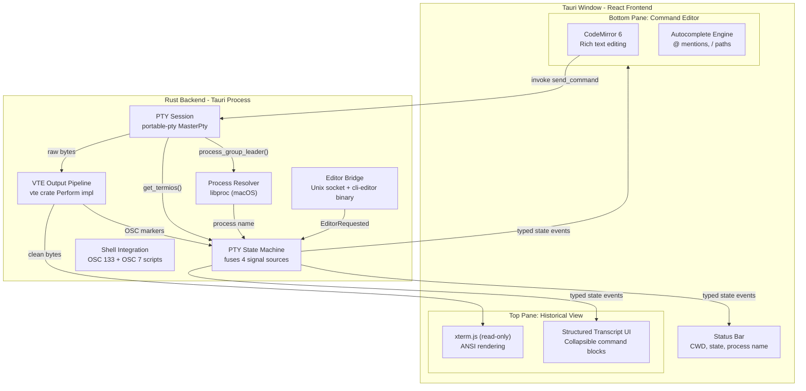

# Transcript-First Terminal App

## Architecture Decision: Tauri v2 (Rust + React/TypeScript)

**Why Tauri v2 over alternatives:**

- **vs. Swift/SwiftUI**: Web technologies give us xterm.js (battle-tested ANSI rendering) and CodeMirror 6 (best-in-class text editor) for free. Building these natively in Swift would take months.
- **vs. Electron**: Tauri uses macOS's native WKWebView instead of bundled Chromium. ~10x smaller binary, ~5x less RAM.
- **vs. Pure web app**: Tauri gives us native Rust PTY access, filesystem control, and process monitoring -- impossible from a browser.

**Key libraries (Rust backend):**

- `portable-pty` v0.9 -- PTY lifecycle management. Its `MasterPty` trait exposes `as_raw_fd()`, `get_termios()`, and `process_group_leader()` -- the exact hooks we need for deep state monitoring. We use this crate directly, NOT `tauri-plugin-pty` (too thin a wrapper, hides the fd).
- `vte` -- Alacritty's terminal parser. Processes raw PTY byte stream in Rust to extract OSC 133 shell integration markers and detect mode changes *before* forwarding bytes to the frontend. All parsing intelligence lives server-side.
- `libproc` v0.14 -- macOS-specific process info. Resolves PIDs to process names for foreground process identification (replaces Linux's `/proc/{pid}/comm`).
- `nix` -- POSIX wrappers for `tcgetattr()`, signal sending (`kill()`), and process group ops.
- `tokio` -- async runtime (already included by Tauri v2). Used for non-blocking PTY I/O, timers, and multiplexing the monitor/reader/bridge tasks.

**Key libraries (frontend):**

- `xterm.js` -- terminal output rendering with `disableStdin: true` for read-only mode
- `CodeMirror 6` + `@codemirror/autocomplete` -- rich text editor with custom completion providers
- `@tauri-apps/api` -- Tauri IPC event subscription and command invocation

---

## Core Design Principle: PTY State Machine

The most critical architectural decision: **all PTY intelligence lives in the Rust backend.** The frontend is a dumb renderer that receives typed, structured events. It never parses raw bytes, never guesses at shell state, never polls for process info.

The Rust backend runs a **PTY State Machine** that fuses four independent signal sources into a single authoritative view of what the shell is doing right now:




### Signal Source 1: OSC 133 Markers (command lifecycle)

Shell integration scripts injected at startup emit escape sequences that mark command boundaries. The `vte` crate's `Perform` trait intercepts these in the Rust output pipeline:

- `\x1b]133;A\x07` -- Prompt start. Shell is about to draw its prompt.
- `\x1b]133;B\x07` -- Prompt end. Cursor is positioned for user input.
- `\x1b]133;C\x07` -- Command executing. User pressed Enter, output will follow.
- `\x1b]133;D;{exit_code}\x07` -- Command finished. Includes exit code.
- `\x1b]7;file://{host}{cwd}\x07` -- CWD changed. Reports current working directory.

These markers are **stripped from the byte stream** before forwarding to xterm.js (they are metadata for us, not display content).

### Signal Source 2: Terminal Attributes (input mode detection)

`portable-pty`'s `MasterPty::get_termios()` returns the `Termios` struct for the PTY slave. Key flags in `c_lflag`:


| Flag Combination  | Meaning                       | Example                                 |
| ----------------- | ----------------------------- | --------------------------------------- |
| `ICANON + ECHO`   | Line-buffered input with echo | Normal shell prompt, simple Y/N prompts |
| `ICANON + !ECHO`  | Line-buffered, no echo        | Password entry (`sudo`, `ssh`)          |
| `!ICANON + !ECHO` | Raw mode, no echo             | Full TUI app (vim, less, htop)          |
| `!ICANON + ECHO`  | Raw mode with echo            | Rare; some custom REPLs                 |


Polled every 100ms on a dedicated tokio task. A change in terminal attributes is the **strongest possible signal** that the program's input expectations have changed. Far more reliable than heuristic pattern matching on output text.

### Signal Source 3: Foreground Process (who is running)

`MasterPty::process_group_leader()` returns the PID of the foreground process group leader. Combined with `libproc::proc_pid::name(pid)` on macOS, this tells us exactly which program is in the foreground:

- PID matches shell PID -> shell is in foreground (waiting for input or running a builtin)
- PID differs from shell PID -> a child process is running. Name tells us what:
  - `git`, `npm`, `cargo` -> normal command execution
  - `vim`, `nvim`, `nano` -> text editor (might be intercepted by our $EDITOR bridge)
  - `less`, `man`, `htop` -> interactive TUI requiring raw-mode passthrough
  - `ssh` -> sub-shell, may need special handling

Polled every 200ms. Changes trigger immediate state transitions.

### Signal Source 4: Output Timing (stall detection)

Tracks data flow rate on the PTY output stream:

- **Flowing**: bytes received within the last 200ms. Command is actively producing output.
- **Stalled**: no bytes for >500ms while a command is still running (no OSC `D` marker received). Combined with other signals, this suggests the program is waiting for input.
- **Burst detection**: high byte rate (>10KB/s) suggests streaming output (log tailing, compilation). UI should auto-scroll.

Implemented as a simple timestamp tracker updated on every `read()` from the PTY master.

### State Machine States and Transitions

```rust
pub enum PtyState {
    /// Shell prompt is displayed, waiting for user to submit a command.
    /// Entered when: OSC 133;A received, or OSC 133;D received.
    ShellReady { cwd: PathBuf, last_exit_code: Option<i32> },

    /// A command has been sent to the PTY but hasn't started producing output yet.
    /// Entered when: we write a command to the PTY writer.
    CommandSent { command: String },

    /// Command is actively running and producing output.
    /// Entered when: OSC 133;C received, or first output bytes after CommandSent.
    CommandRunning {
        command: String,
        fg_process: String,       // e.g. "git", "npm", "cargo"
        output_flowing: bool,     // true if bytes received recently
    },

    /// A running command has stopped producing output -- likely waiting for input.
    /// Entered when: CommandRunning + output stalled >500ms + termios still canonical.
    InputExpected {
        hint: String,             // last line of output (e.g. "Continue? [Y/n]")
        echo_enabled: bool,       // false = password prompt
    },

    /// A full-screen TUI app is running (vim, less, htop, etc.)
    /// Entered when: tcgetattr shows !ICANON (raw mode) + foreground process changed.
    RawMode {
        process_name: String,
        is_editor: bool,          // true if process is vim/nvim/nano/emacs
    },

    /// Our custom $EDITOR bridge is active -- file editing in CodeMirror.
    /// Entered when: editor bridge receives a connection on the Unix socket.
    EditorActive { file_path: PathBuf },

    /// Shell process has exited.
    /// Entered when: child process wait() returns.
    Exited { exit_code: i32 },
}
```

**Transition diagram:**




---

## Output Processing Pipeline

Raw PTY bytes pass through a Rust-side pipeline before reaching the frontend. This is the heart of the architecture:




The VTE `Perform` implementation intercepts:

- `osc_dispatch()` -- captures OSC 133 markers and OSC 7 (CWD). Feeds them to the state machine. Does NOT forward to the output buffer.
- `print()`, `execute()`, `csi_dispatch()`, etc. -- normal display data. Forwarded to output buffer unchanged.

Output is batched on a 16ms cadence (one frame at 60fps) to avoid overwhelming the frontend with thousands of tiny Tauri events during high-throughput output (e.g., `cat large_file.txt`).

---

## High-Level Architecture




---

## Project Structure

```
cli/
  src-tauri/                    # Rust backend
    src/
      main.rs                   # Tauri entry: registers commands, spawns PTY session
      pty/
        mod.rs                  # Re-exports
        session.rs              # PtySession: spawn, write, resize, kill
        state_machine.rs        # PtyState enum + transition logic + event emission
        output_pipeline.rs      # VTE Perform impl: parse stream, strip OSC, buffer output
        termios_monitor.rs      # Polls get_termios() for ICANON/ECHO changes
        process_monitor.rs      # Polls process_group_leader() + libproc for fg process
      shell/
        mod.rs
        integration.rs          # Generates shell integration scripts (zsh, bash)
        scripts/
          integration.zsh       # precmd/preexec hooks emitting OSC 133 + OSC 7
          integration.bash      # PROMPT_COMMAND + DEBUG trap equivalent
      editor/
        mod.rs
        bridge.rs               # Unix domain socket server for $EDITOR IPC
      commands.rs               # Tauri #[command] handlers exposed to frontend
    Cargo.toml
    tauri.conf.json
    bin/
      cli-editor/
        main.rs                 # Tiny binary: connects to socket, sends path, waits

  src/                          # React/TypeScript frontend
    main.tsx
    App.tsx                     # Root layout: SplitPane + StatusBar
    components/
      HistoricalView/
        HistoricalView.tsx      # Scrollable list of TranscriptEntry components
        TranscriptEntry.tsx     # Single command block: prompt + output + status
        XtermRenderer.tsx       # xterm.js instance wrapper (disableStdin: true)
        RawTerminalView.tsx     # Full xterm.js takeover for TUI app fallback
      CommandEditor/
        CommandEditor.tsx       # CodeMirror 6 wrapper
        useAutoExpand.ts        # Expand on focus/content, collapse on submit
        EditorModeOverlay.tsx   # Full-file editing mode for $EDITOR bridge
        completions/
          pathProvider.ts       # Queries Rust backend for directory listings on /
          mentionProvider.ts    # @ mention completions (extensible)
      SplitPane/
        SplitPane.tsx           # Resizable vertical split
      StatusBar/
        StatusBar.tsx           # Shows PtyState: CWD, fg process, exit code
    hooks/
      usePtyEvents.ts           # Subscribes to all Tauri PTY events, dispatches to stores
      useTranscript.ts          # Builds structured transcript from typed events
      usePtyState.ts            # Tracks current PtyState for UI decisions
    types/
      pty.ts                    # TypeScript types mirroring Rust PtyState and events
    styles/
      global.css

  package.json
  tsconfig.json
  vite.config.ts
```

---

## Component Details

### 1. PTY Session (Rust: `pty/session.rs`)

Owns the `portable-pty` resources and provides the low-level API:

```rust
pub struct PtySession {
    master: Box<dyn MasterPty + Send>,
    child: Box<dyn Child + Send + Sync>,
    writer: Box<dyn Write + Send>,
    reader: Box<dyn Read + Send>,
    shell_pid: u32,
}

impl PtySession {
    /// Spawns a new shell with injected integration scripts and $EDITOR override.
    pub fn spawn(config: &SessionConfig) -> Result<Self>;

    /// Writes raw bytes to PTY stdin. Used for both commands and interactive input.
    pub fn write(&mut self, data: &[u8]) -> Result<()>;

    /// Reads a chunk of output bytes (blocking). Called in a loop on a background task.
    pub fn read(&mut self, buf: &mut [u8]) -> Result<usize>;

    /// Queries current terminal attributes (ICANON, ECHO, etc.)
    pub fn get_termios(&self) -> Option<Termios>;

    /// Returns PID of the current foreground process group leader.
    pub fn foreground_pid(&self) -> Option<u32>;

    /// Resizes the PTY window (triggers SIGWINCH in child).
    pub fn resize(&self, cols: u16, rows: u16) -> Result<()>;

    /// Sends a signal to the foreground process (e.g., SIGINT for Ctrl+C).
    pub fn signal_foreground(&self, signal: Signal) -> Result<()>;
}
```

Key detail: `spawn()` constructs the environment before creating the PTY:

1. Inherits the user's full environment
2. Sets `TERM_PROGRAM=cli-app` (lets shell scripts detect our app)
3. Sets `EDITOR` and `VISUAL` to the path of our `cli-editor` binary
4. Prepends our shell integration script to the shell's init:
  - For zsh: sets `ZDOTDIR` to a temp dir with a `.zshrc` that sources the user's real rc + our integration
  - For bash: uses `--rcfile` to source our integration + user's `.bashrc`

### 2. Output Pipeline (Rust: `pty/output_pipeline.rs`)

A `vte::Perform` implementation that sits between the PTY reader and the frontend:

```rust
pub struct OutputPipeline {
    state_machine: Arc<Mutex<PtyStateMachine>>,
    output_buffer: Vec<u8>,          // clean bytes for xterm.js
    current_osc_buf: Vec<u8>,        // accumulates OSC payload
    last_output_time: Instant,       // for stall detection
}

impl vte::Perform for OutputPipeline {
    fn osc_dispatch(&mut self, params: &[&[u8]], bell_terminated: bool) {
        // Intercept OSC 133 (shell integration) and OSC 7 (CWD)
        // Feed parsed markers to state machine
        // Do NOT append to output_buffer (strip from stream)
    }

    fn print(&mut self, c: char) {
        // Normal printable character -- append to output_buffer
    }

    fn execute(&mut self, byte: u8) {
        // Control characters (newline, carriage return, etc.) -- append to output_buffer
    }

    fn csi_dispatch(&mut self, params: &Params, intermediates: &[u8], ignore: bool, action: char) {
        // CSI sequences (colors, cursor movement) -- append raw bytes to output_buffer
    }
    // ... other Perform methods forward to output_buffer
}
```

The output buffer is flushed to the frontend every 16ms (batched into a single Tauri event per frame).

### 3. PTY State Machine (Rust: `pty/state_machine.rs`)

The central orchestrator. Receives signals from all four sources and maintains authoritative state:

```rust
pub struct PtyStateMachine {
    state: PtyState,
    app_handle: AppHandle,     // for emitting Tauri events
    shell_pid: u32,            // to distinguish shell from child processes
}

impl PtyStateMachine {
    /// Called by OutputPipeline when an OSC 133 marker is parsed.
    pub fn on_osc_marker(&mut self, marker: OscMarker);

    /// Called by TermiosMonitor when terminal attributes change.
    pub fn on_termios_change(&mut self, termios: Termios);

    /// Called by ProcessMonitor when the foreground process changes.
    pub fn on_foreground_change(&mut self, pid: u32, name: String);

    /// Called by the output read loop when bytes are/aren't received.
    pub fn on_output_activity(&mut self, bytes_read: usize);

    /// Called by EditorBridge when cli-editor connects.
    pub fn on_editor_request(&mut self, file_path: PathBuf);

    /// Called by EditorBridge when the user finishes editing.
    pub fn on_editor_done(&mut self);
}
```

Each `on_*` method evaluates the transition rules and, if the state changes, emits a Tauri event:

```rust
// Events emitted to frontend (all serialized as JSON via serde)
pub enum PtyEvent {
    /// Clean bytes for xterm.js rendering (OSC markers already stripped).
    Output { data: Vec<u8> },

    /// State machine transitioned. Frontend updates all UI accordingly.
    StateChanged { state: PtyState },

    /// A structured transcript entry is complete.
    TranscriptEntry {
        command: String,
        exit_code: i32,
        cwd: PathBuf,
        timestamp: u64,
    },
}
```

### 4. Termios Monitor (Rust: `pty/termios_monitor.rs`)

Dedicated tokio task that polls terminal attributes:

```rust
pub async fn run_termios_monitor(
    session: Arc<PtySession>,
    state_machine: Arc<Mutex<PtyStateMachine>>,
) {
    let mut last_lflag: u32 = 0;
    loop {
        if let Some(termios) = session.get_termios() {
            let lflag = termios.c_lflag;
            if lflag != last_lflag {
                state_machine.lock().on_termios_change(termios);
                last_lflag = lflag;
            }
        }
        tokio::time::sleep(Duration::from_millis(100)).await;
    }
}
```

100ms polling interval is fast enough to catch mode changes (vim startup takes ~50-100ms) without measurable CPU cost.

### 5. Process Monitor (Rust: `pty/process_monitor.rs`)

Dedicated tokio task that polls the foreground process:

```rust
pub async fn run_process_monitor(
    session: Arc<PtySession>,
    state_machine: Arc<Mutex<PtyStateMachine>>,
) {
    let mut last_pid: Option<u32> = None;
    loop {
        if let Some(pid) = session.foreground_pid() {
            if Some(pid) != last_pid {
                let name = libproc::proc_pid::name(pid as i32)
                    .unwrap_or_else(|_| "unknown".to_string());
                state_machine.lock().on_foreground_change(pid, name);
                last_pid = Some(pid);
            }
        }
        tokio::time::sleep(Duration::from_millis(200)).await;
    }
}
```

### 6. Shell Integration (`shell/integration.rs` + `scripts/`)

`**scripts/integration.zsh**` -- sourced automatically at shell startup:

```zsh
# Emit OSC 133 markers for command lifecycle tracking
__cli_app_precmd() {
    local exit_code=$?
    # Report command completion with exit code (skip on first prompt)
    if [[ -n "$__cli_app_cmd_started" ]]; then
        printf '\e]133;D;%d\a' "$exit_code"
        unset __cli_app_cmd_started
    fi
    # Report CWD
    printf '\e]7;file://%s%s\a' "${HOST}" "${PWD}"
    # Report prompt start
    printf '\e]133;A\a'
}

__cli_app_preexec() {
    # Report prompt end + command start
    printf '\e]133;B\a'
    printf '\e]133;C\a'
    __cli_app_cmd_started=1
}

precmd_functions=(__cli_app_precmd $precmd_functions)
preexec_functions=(__cli_app_preexec $preexec_functions)

# Initial prompt marker
printf '\e]133;A\a'
```

The Rust `integration.rs` module writes this script to a temp file and configures the shell to source it at startup by manipulating `ZDOTDIR` (zsh) or `--rcfile` (bash).

### 7. Custom Editor Bridge (`editor/bridge.rs` + `bin/cli-editor`)

`**cli-editor` binary** (set as `$EDITOR` and `$VISUAL`):

- Receives file path as argv[1]
- Connects to Unix domain socket at `$CLI_APP_EDITOR_SOCK` (set in PTY env)
- Sends `{"action":"edit","path":"/tmp/COMMIT_EDITMSG"}`
- Blocks on socket read until `{"action":"done"}` is received
- Exits with code 0 (signaling success to the calling program like git)

`**editor/bridge.rs`** (server running in the Tauri process):

- Binds a Unix domain socket at a temp path, stores path in `CLI_APP_EDITOR_SOCK` env var
- When `cli-editor` connects, calls `state_machine.on_editor_request(path)`
- State machine transitions to `EditorActive`, frontend receives event, loads file in CodeMirror
- When user finishes editing (Cmd+S then Cmd+W, or a "Done" button), frontend invokes a Tauri command
- Bridge writes `{"action":"done"}` to the socket, `cli-editor` unblocks and exits

### 8. Historical View (React: `HistoricalView.tsx`)

Two rendering modes, switched by `PtyState`:

**Structured transcript mode** (when state is `ShellReady`, `CommandSent`, `CommandRunning`, `InputExpected`):

- Scrollable list of `TranscriptEntry` components
- Each entry: command text + xterm.js renderer for output + exit code badge
- A single shared xterm.js `Terminal` instance with `disableStdin: true` renders output for the active/latest command
- Completed entries are rendered as static ANSI-to-HTML (using xterm.js `SerializeAddon`) for better scroll performance
- Auto-scrolls to bottom during active output; stops auto-scroll if user scrolls up

**Raw terminal mode** (when state is `RawMode`):

- A full-size xterm.js instance takes over the entire top pane
- PTY output bytes are fed directly to this instance (bypasses transcript segmentation)
- Bottom pane shows a simplified input bar for sending keystrokes
- Exits back to transcript mode when state transitions out of `RawMode`

### 9. Command Editor (React: `CommandEditor.tsx`)

CodeMirror 6 instance configured for shell command editing:

- **Syntax**: `@codemirror/lang-shell` or a minimal custom Lezer grammar
- **Autocomplete**:
  - `/` triggers: Tauri command `list_directory(path)` returns entries, fed to CodeMirror completion
  - `@` triggers: extensible provider system (files, git branches, bookmarks)
  - Up arrow with empty editor: cycles through command history (stored in `useTranscript`)
- **Expand/collapse**:
  - Resting: 1 line, styled to look like a prompt line (shows CWD as placeholder)
  - On focus or multiline content: smooth CSS transition to expanded height (up to 50% of window)
  - On submit (Cmd+Enter or Enter when single line): content sent to PTY, editor collapses and clears
- **Mode adaptation** based on `PtyState`:
  - `ShellReady`: full editor, Cmd+Enter submits
  - `InputExpected`: editor shows a hint from the last output line, Enter submits (single line only)
  - `EditorActive`: CodeMirror loads file contents, shows file name in tab, Cmd+S saves to disk
  - `RawMode`: editor replaced by a minimal keystroke bar

### 10. Input Prompt Detection

Combines multiple signals for reliable detection (no single signal is sufficient alone):

1. **OSC 133 state**: `C` marker received (command started) but no `D` marker yet.
2. **Terminal attributes**: `get_termios()` shows `ICANON` still set (canonical mode -- program expects line input, not raw keystrokes). If `ECHO` is cleared, it is a password prompt.
3. **Output timing**: no output for >500ms while command is still running.
4. **Foreground process**: same process still in foreground (hasn't spawned a child or exited).
5. **Heuristic** (lowest priority, used for hint text): last line of output matches patterns like `[Y/n]`, `password:`, `Enter value:`, `?` , `>` .

When signals 1-4 all agree, the state machine transitions to `InputExpected` with high confidence. The heuristic in signal 5 is only used to populate the `hint` field for the UI, not for the state decision itself.

---

## Key Technical Decisions

### Why build our own PTY layer instead of using `tauri-plugin-pty`?

`tauri-plugin-pty` is a thin convenience wrapper that pipes raw bytes between the PTY and frontend. Our app's core value proposition is *understanding* what the terminal is doing. We need direct access to `get_termios()`, `process_group_leader()`, and `as_raw_fd()` on the `MasterPty`, plus a Rust-side VTE parser for OSC extraction. The plugin would just be in the way.

### Why parse PTY output in Rust (vte) rather than JavaScript?

Three reasons: (1) The VTE parser needs to see every byte at wire speed to correctly track state -- JavaScript's event loop adds latency and dropped frames. (2) The state machine needs output timing information that's only accurate at the read() call site. (3) OSC markers must be stripped before bytes reach xterm.js (they'd render as garbage), and doing this correctly requires a proper terminal parser, not regex.

### Why four signal sources instead of just OSC 133?

OSC 133 alone has blind spots:

- It can't detect password prompts (the shell hook fires before the command starts; the program's stdin read is invisible to OSC).
- It can't detect when a program switches to raw mode (vim, less) -- that happens after the command starts.
- It can't detect sub-programs spawned by a script that prompt for input.
- If the user's shell config breaks our hooks, OSC markers stop entirely.

The four-signal fusion approach degrades gracefully: even if OSC 133 fails completely, `tcgetattr()` + `process_group_leader()` + timing still give us enough to detect all major states.

### Why not send keystrokes individually?

The entire point of this app. Sending keystrokes one at a time means the shell processes partial input, which prevents rich editing. By buffering the full command and sending it all at once, we can offer mouse selection, drag-and-drop, autocomplete, and multi-line editing.

### Why a custom `$EDITOR` binary instead of detecting vim in-PTY?

Detecting vim and trying to interact with it through the PTY would require implementing a full terminal emulator (parse cursor movement, screen regions, alternate screen buffer). The `$EDITOR` bridge sidesteps this entirely -- editing happens in our CodeMirror UI, and the calling program never knows the difference.

### Why xterm.js for rendering instead of custom ANSI-to-HTML?

CLI tools use complex ANSI sequences (256 colors, cursor movement, alternate screen buffer). xterm.js handles all of this correctly because it is a full VT-compatible terminal emulator. Rolling our own renderer would take months and still miss edge cases.

---

## Concurrency Model

All long-running work happens on tokio tasks, coordinated through the shared `Arc<Mutex<PtyStateMachine>>`:

```
Main thread (Tauri/webview)
  |
  +-- tokio task: PTY output reader loop
  |     Reads from PtySession, feeds bytes to VTE parser (OutputPipeline),
  |     flushes output buffer to frontend every 16ms.
  |
  +-- tokio task: Termios monitor
  |     Polls get_termios() every 100ms, calls state_machine.on_termios_change().
  |
  +-- tokio task: Process monitor
  |     Polls foreground_pid() every 200ms, resolves name via libproc,
  |     calls state_machine.on_foreground_change().
  |
  +-- tokio task: Editor bridge listener
  |     Accepts connections on Unix domain socket.
  |     Calls state_machine.on_editor_request() / on_editor_done().
  |
  +-- Tauri command handlers (called from frontend via IPC)
        send_command(), send_input(), resize(), signal_foreground(),
        save_editor_file(), list_directory(), etc.
```

---

## Prerequisites to Install

Before scaffolding:

1. **Rust toolchain**: `curl --proto '=https' --tlsv1.2 -sSf https://sh.rustup.rs | sh`
2. **Xcode Command Line Tools**: `xcode-select --install` (required for macOS linking)
3. Tauri v2 CLI: installed automatically via npm devDependencies (`@tauri-apps/cli`)

---

## Implementation Phases

### Phase 1: Scaffold + PTY Session + State Machine Foundation

- Install Rust toolchain
- Scaffold Tauri v2 project: `create-tauri-app` with React/TypeScript template
- Implement `PtySession` (spawn zsh, read/write, get_termios, foreground_pid)
- Implement `OutputPipeline` with VTE parser (initially just forwards all bytes, no OSC parsing yet)
- Implement skeleton `PtyStateMachine` with `ShellReady` and `CommandRunning` states
- Wire up Tauri commands: `send_command`, `resize`
- Wire up Tauri events: `pty:output`, `pty:state_changed`
- Minimal frontend: `<pre>` for output, `<textarea>` for input, submit button
- **Milestone**: type a command in the textarea, see output appear in the pre element

### Phase 2: Core UI (xterm.js + CodeMirror + Split Pane)

- Replace `<pre>` with xterm.js (`disableStdin: true`, dark theme)
- Replace `<textarea>` with CodeMirror 6 (shell syntax, basic keybindings)
- Build `SplitPane` component with draggable divider
- Implement `useAutoExpand` hook (1-line default, expand on focus/content, collapse on submit)
- Implement `StatusBar` showing current `PtyState`
- **Milestone**: app looks and feels like a real terminal, but commands are composed in a rich editor

### Phase 3: Shell Integration + Structured Transcript

- Write `integration.zsh` and `integration.bash` scripts (OSC 133 + OSC 7)
- Implement shell script injection in `PtySession::spawn()` (ZDOTDIR trick for zsh)
- Implement OSC 133 interception in `OutputPipeline::osc_dispatch()`
- Wire OSC markers to state machine transitions (ShellReady, CommandSent, CommandRunning, back to ShellReady)
- Implement `TranscriptEntry` component (command + output block + exit code badge)
- Build `useTranscript` hook that segments events into entries
- Implement command history (up/down arrow in empty CodeMirror)
- **Milestone**: each command is a distinct visual block with its exit status

### Phase 4: Full State Machine (Termios + Process Monitor + Input Detection)

- Implement `termios_monitor` tokio task (100ms poll, detects ICANON/ECHO changes)
- Implement `process_monitor` tokio task (200ms poll, libproc name resolution)
- Implement output timing tracker in OutputPipeline
- Add `InputExpected`, `RawMode` states to the state machine with full transition logic
- Frontend: adapt `CommandEditor` for `InputExpected` state (show hint, Enter submits)
- Frontend: implement `RawTerminalView` for `RawMode` fallback
- Implement `signal_foreground` Tauri command (Ctrl+C sends SIGINT)
- **Milestone**: app correctly detects password prompts, Y/N prompts, and vim/less launches

### Phase 5: Editor Bridge ($EDITOR Replacement)

- Build `cli-editor` binary (Rust workspace member) -- socket client, blocks until done
- Implement `editor/bridge.rs` Unix domain socket server
- Wire bridge to state machine (`EditorActive` state)
- Implement `EditorModeOverlay` in frontend (CodeMirror loads file, shows filename, Cmd+S saves)
- Set `EDITOR`, `VISUAL`, and `CLI_APP_EDITOR_SOCK` in PTY environment
- **Milestone**: `git commit` opens our editor, user writes message, saves, git completes

### Phase 6: Autocomplete + Rich Editor Features

- Implement `list_directory` Tauri command for filesystem path completion
- Build `pathProvider.ts` CodeMirror completion source (triggers on `/`)
- Build `mentionProvider.ts` completion source (triggers on `@`, extensible)
- Shell command history search completion
- Syntax highlighting refinements for shell commands
- **Milestone**: typing `/usr/lo` shows path completions, `@` shows contextual mentions

### Phase 7: Polish + Edge Cases

- Dark/light theme toggle (CSS custom properties)
- Handle terminal resize (window resize -> `session.resize()` -> SIGWINCH)
- Handle Ctrl+C, Ctrl+D, Ctrl+Z through dedicated UI buttons + keyboard shortcuts
- Large output handling (virtualized scrolling for transcript entries >10K lines)
- Binary output detection (if output contains many non-UTF-8 bytes, show warning)
- Multiple tabs / sessions (each tab owns its own PtySession + state machine)
- Graceful shutdown (SIGHUP to child processes on app quit)

